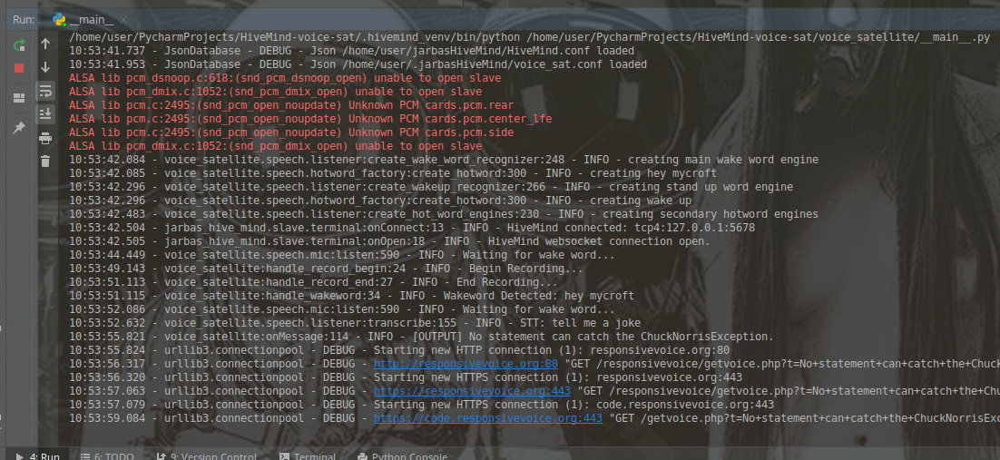

# HiveMind Voice Satellite

Mycroft Voice Satellite, connect to  [Mycroft HiveMind](https://github.com/JarbasSkills/skill-hivemind)


* [Setup](#setup)
* [Usage](#usage)
* [Configuration](#configuration)
  - [configure speech to text](#configure-speech-to-text)
  - [configure text to speech](#configure-text-to-speech)
  - [configure hotwords](#configure-hotwords)
  - [configure listener](#configure-listener)
  - [configure audio playback](#configure-audio-playback)





## Install

```bash
$ pip install HiveMind-voice-sat
```
## Usage

If host is not provided auto discovery will be used

```bash
$ HiveMind-voice-sat --help

usage: HiveMind-voice-sat [-h] [--access_key ACCESS_KEY] [--crypto_key CRYPTO_KEY] [--name NAME] [--host HOST] [--port PORT]

optional arguments:
  -h, --help            show this help message and exit
  --access_key ACCESS_KEY
                        access key
  --crypto_key CRYPTO_KEY
                        payload encryption key
  --name NAME           human readable device name
  --host HOST           HiveMind host
  --port PORT           HiveMind port number
```

Default values are

```
--access_key - "RESISTENCEisFUTILE"
--crypto_key - "resistanceISfutile"
--name - "JarbasVoiceTerminal"
--port" - 5678

```

## Configuration

You can set the configuration at
    
    ~/.cache/json_database/HivemindVoiceSatellite.json
    
Otherwise default configuration will be used, check bellow for defaults

### configure speech to text
```json
{
    "lang": "en-us",
    "stt": {
        "module": "google"
    }
}
```

### configure text to speech
```json
{
    "lang": "en-us",
    "tts": {
        "module": "responsive_voice"
    }
}
```

### Configure hotwords

add any number of hot words to config
- hot word can be any engine (snowboy/pocketsphinx/precise)
- hot word can trigger listening or not
- hot word can play a sound or not
- hot word can be treated as full utterance or not

```json
{
    "hotwords": {
        "hey mycroft": {
            "module": "pocketsphinx",
            "phonemes": "HH EY . M AY K R AO F T",
            "threshold": 1e-90,
            "lang": "en-us",
            "sound": "snd/start_listening.wav",
            "listen": true
        },
        "thank you": {
            "module": "pocketsphinx",
            "phonemes": "TH AE NG K . Y UW .",
            "threshold": 0.1,
            "listen": false,
            "utterance": "thank you",
            "active": false,
            "sound": "",
            "lang": "en-us"
        },
        "wake up": {
            "module": "pocketsphinx",
            "phonemes": "W EY K . AH P",
            "threshold": 1e-20,
            "lang": "en-us"
        }
    }
}
```

### configure listener

```json
{
    "data_dir": "~/jarbasHiveMind/recordings",
    "listener": {
        "sample_rate": 16000,
        "channels": 1,
        "record_wake_words": false,
        "record_utterances": false,
        "phoneme_duration": 120,
        "multiplier": 1.0,
        "energy_ratio": 1.5,
        "stand_up_word": "wake up",
        "signal_folder": "/tmp/hivemind/ipc",
        "listen_sound": "snd/start_listening.wav",
        "error_sound": "snd/listening_error.mp3"
    }
}
```
data_dir is where recordings are saved, 

    {data_dir}/utterances
    {data_dir}/hotwords

you can optionally set device_index
```json
{
    "listener": {
        "device_index": 0
    }
}
```  
or device_name, which is a name or regex pattern
```json
{
    "listener": {
        "device_name": "respeaker"
    }
}
```  

To trigger listening without a wakeword you can use an external signal

```bash
 touch {ipc_path}/signal/startListening
```

ipc_path can be set in config, default is ```/tmp/hivemind/ipc```

### Configure audio playback

you shouldn"t need to change this, a common change is replacing ```aplay``` with ```paplay``` when using pulseaudio, or use sox for everything

```json
{
    "playback": {
        "play_wav_cmd": "aplay %1",
        "play_mp3_cmd": "mpg123 %1",
        "play_ogg_cmd": "ogg123 -q %1",
        "play_fallback_cmd": "play %1"
    }
}

```